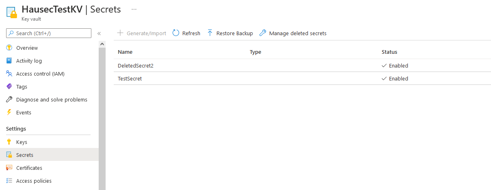

# AZT604.1 - Azure Key Vault Dumping: Azure Key Vault Secret Dump

By accessing an Azure Key Vault, an adversary may dump any or all secrets.

!!! info "Resource" 

	Azure Key Vault

!!! success "Actions"

	* Microsoft.KeyVault/vaults/secrets/getSecret/action

!!! example "Examples"

    === "Az PowerShell"

		[`#!powershell Get-AzKeyVaultSecret`](https://docs.microsoft.com/en-us/powershell/module/az.keyvault/get-azkeyvaultsecret?view=azps-8.0.0)
		
	=== "Azure CLI"
	
		[`#!python az keyvault secret`](https://docs.microsoft.com/en-us/cli/azure/keyvault/secret?view=azure-cli-latest)

	=== "Azure REST API"
	
		[`#!python GET {vaultBaseUrl}/secrets/{secret-name}/{secret-version}?api-version=7.3`](https://docs.microsoft.com/en-us/rest/api/keyvault/secrets/get-secret/get-secret)	

    === "Azure Portal"

		

!!! abstract "Detections"

	## **Detection Details**

	By default, logging is not enabled on Key Vaults, meaning whenever a secret/key/certificate is accessed, it will not be logged unless Key Vault logging is turned on. 

	## **Logs**

    | Data Source        | Operation Name     | Action                                                            | Log Location |
    |--------------------|---------------------|-------------------------------------------------------------------|--------------|
	| Azure Diagnostics | SecretGet	 | N/A	| Log Analytics |

	## **Queries**

	| Platform | Query |
    |----------|-------|
	| Log Analytics | `#!sql AzureDiagnostics | where ResourceProvider =="MICROSOFT.KEYVAULT" and OperationName == "SecretGet"` |

!!! faq "Additional Resources"

	[https://docs.microsoft.com/en-us/azure/key-vault/general/logging?WT.mc_id=Portal-fx&tabs=Vault](https://docs.microsoft.com/en-us/azure/key-vault/general/logging?WT.mc_id=Portal-fx&tabs=Vault)
