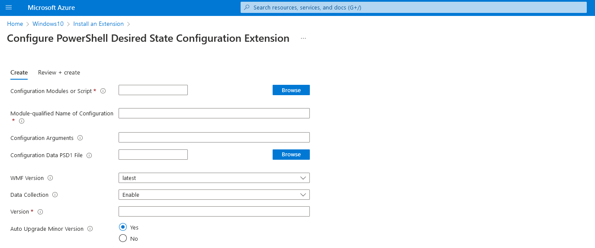

# AZT301.3 - Virtual Machine Scripting: Desired State Configuration

By utilizing the 'Desired State Configuration extension' extension on a Virtual Machine, an attacker can pass PowerShell commands to the VM as SYSTEM.

!!! info "Resource" 

	* Virtual Machine
	* Virtual Machine Scale Sets

!!! success "Actions"

	* Microsoft.Compute/virtualMachines/extensions/*
	* Microsoft.Compute/virtualMachines/write

!!! example "Examples"

    === "Az PowerShell"
		[`#!powershell Set-AzVMDscExtension`](https://docs.microsoft.com/en-us/powershell/module/az.compute/set-azvmdscextension?view=azps-8.0.0)

    === "Azure CLI"
        [`#!powershell az vm extension set`](https://docs.microsoft.com/en-us/cli/azure/vm/extension?view=azure-cli-latest#az-vm-extension-set)
		
    === "Azure REST API"	
		[`#!powershell PUT https://management.azure.com/subscriptions/{subscription-id}/resourceGroups/{rg name}/providers/Microsoft.Compute/virtualMachines/{vm name]/extensions/DSC?api-version=2022-03-01`](https://docs.microsoft.com/en-us/rest/api/compute/virtual-machine-extensions/create-or-update)
	
    === "Azure Portal"
    	

!!! abstract "Detections"

	## **Logs** 

    | Data Source        | Operation Name     | Action/On-Disk Location                                                            | Log Provider |
    |--------------------|---------------------|-------------------------------------------------------------------|--------------|
    | Resource | Create or Update Virtual Machine Extension	 | Microsoft.Compute/virtualMachines/extensions/write	| AzureActivity |
	| On-Resource File    | File Creation       |  C:\Packages\Plugins\Microsoft.Powershell.DSC\2.83.2.0\Status            | Event |

	## **Queries**

	| Platform | Query |
    |----------|-------|
	| Log Analytics | `#!sql let timeframe = toscalar(AzureActivity | where OperationNameValue == 'MICROSOFT.COMPUTE/VIRTUALMACHINES/EXTENSIONS/WRITE' and Properties_d has 'Microsoft.Powershell.DSC' | distinct TimeGenerated); Event | where EventID == '4104' and ParameterXml has 'Microsoft.Powershell.DSC' and RenderedDescription has '.ps1' | where (TimeGenerated - timeframe) <= 1m` |
	| Log Analytics | `#!sql AzureActivity | where OperationNameValue == 'MICROSOFT.COMPUTE/VIRTUALMACHINES/EXTENSIONS/WRITE' and Properties_d has 'Microsoft.Powershell.DSC'`
				
	## **Azure Monitor Alert**
	
	For resources *with* Azure Monitor Agent installed
	
	

	For resources *without* Azure Monitor Agent installed
	
	

	

!!! faq "Additional Resources"

	[https://docs.microsoft.com/en-us/azure/virtual-machines/extensions/dsc-overview](https://docs.microsoft.com/en-us/azure/virtual-machines/extensions/dsc-overview)

