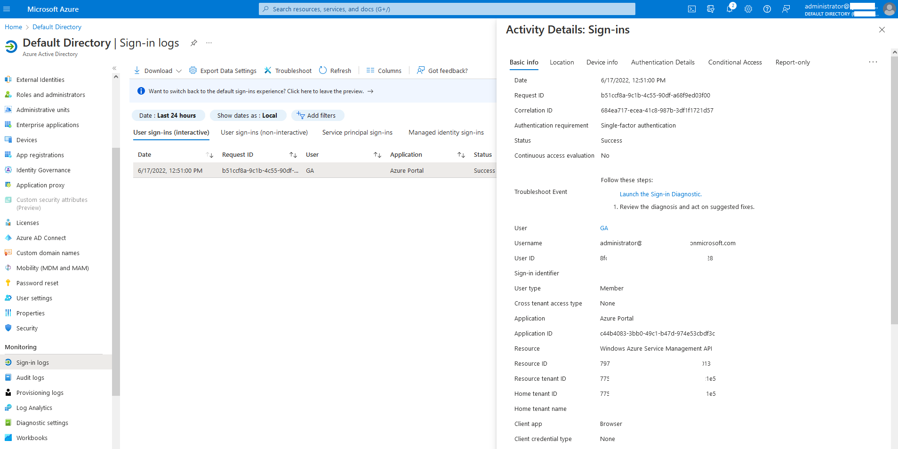
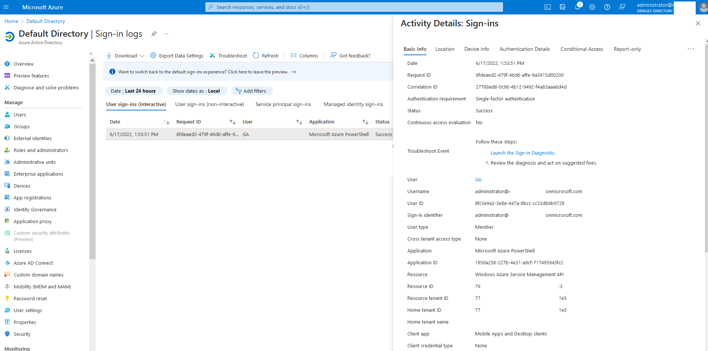

# AZT201.1 - User Account

By obtaining valid user credentials, an adversary may login to AzureAD via command line or through the Azure Portal. 

!!! info "Resource" 

	Azure Active Directory

!!! success "Actions"

	N/A

!!! example "Examples"

    === "Az PowerShell (Secret)"
		[`#!powershell Connect-AzAccount`](https://docs.microsoft.com/en-us/powershell/module/az.accounts/connect-azaccount?view=azps-8.0.0)
		
    === "Azure CLI"
		[`#!powershell az login -u <username> -p <password>`](https://docs.microsoft.com/en-us/cli/azure/authenticate-azure-cli)
		
!!! abstract "Detections"

	## **Logs**

	| Data Source        | Application     | Resource                                                            | Log Provider |
	|--------------------|---------------------|-------------------------------------------------------------------|--------------|
	| Azure Active Directory | Azure Portal	 | Windows Azure Service Management API	| SignInLogs |
	| Azure Active Directory | Microsoft Azure PowerShell	 | Windows Azure Service Management API	| SignInLogs |

	## **Detection Screenshots**
    
    === "Portal Sign-in"
		
			
	=== "PowerShell Sign-in"
		
		
	## **Queries**

	| Platform | Query |
    |----------|-------|
	| Log Analytics | `#!sql SignInLogs | where UserId == 'IDGOESHERE'` |
		
	## **Azure Monitor Alert**
	
	

!!! faq "Additional Resources"

	* [https://docs.microsoft.com/en-us/azure/active-directory/reports-monitoring/concept-sign-ins](https://docs.microsoft.com/en-us/azure/active-directory/reports-monitoring/concept-sign-ins)