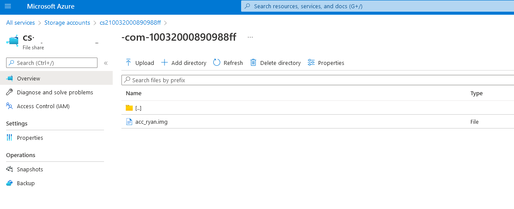

# AZT403.1 - Local Resource Hijack: Cloud Shell .IMG

By modifying the .bashrc file in a CloudShell .IMG file, an adversary may escalate their privileges by injecting commands that will add an arbitrary user account to a desired role and scope.

!!! info "Resource" 

	Azure CloudShell

!!! success "Actions"

	* n/a

!!! example "Examples"

    === "Azure Portal"
    	
 
!!! abstract "Detections"

	## **Detection Details**

	A storage account is created in order to store the profile .IMG file when using CloudShell. These storage accounts always start with `cs` followed by a string of numbers + letters. E.g.: `cs120000000ff`
	Logs from the storage account require them to be configured with diagnostic settings being sent to a log aggregator. 
	
	Additionally, `~/.config/PowerShell/Microsoft.PowerShell_profile.ps1` is where the PowerShell startup script is stored, which also may be a target for backdooring. 
	
	## **Queries**

	| Platform | Query |
    |----------|-------|
	| Log Analytics | `#!sql ` |	
		
	## **Azure Monitor Alert**
	

!!! faq "Additional Resources"

	* [https://docs.microsoft.com/en-us/azure/cloud-shell/overview](https://docs.microsoft.com/en-us/azure/cloud-shell/overview)
	* [https://www.netspi.com/blog/technical/cloud-penetration-testing/attacking-azure-cloud-shell/](https://www.netspi.com/blog/technical/cloud-penetration-testing/attacking-azure-cloud-shell/)