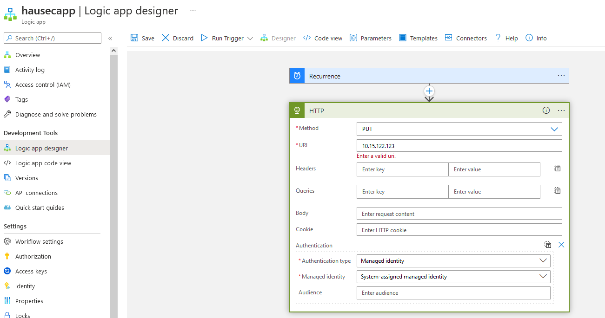

# AZT404.2 - Principal Impersonation: Logic Application 

By utilizing a Logic Application configured with a managed identity or other identity provider, an attacker can execute Azure operations on a given resource.

!!! info "Resource" 

	Logic Application

!!! success "Actions" 

	* Microsoft.Logic/workflows/write
	* Microsoft.Logic/workflows/run/action
	* Microsoft.Logic/operations/read

!!! example "Examples"

    === "Az PowerShell"
		[`#!powershell Set-AzLogicApp`](https://docs.microsoft.com/en-us/powershell/module/az.logicapp/set-azlogicapp?view=azps-8.0.0)

	=== "Azure CLI"
		[`#!python az logicapp start`](https://docs.microsoft.com/en-us/cli/azure/logicapp?view=azure-cli-latest#az-logicapp-start)
		
	=== "Azure REST API"	
		[`#!powershell PUT https://management.azure.com/subscriptions/{subscriptionId}/resourceGroups/{resourceGroupName}/providers/Microsoft.Logic/workflows/{workflowName}?api-version=2016-06-01`](https://docs.microsoft.com/en-us/rest/api/logic/workflows/create-or-update)		

    === "Azure Portal"
    	

 
!!! abstract "Detections"

	## **Logs** 

    | Data Source        | Operation Name     | Action                                                            | Log Provider |
    |--------------------|---------------------|-------------------------------------------------------------------|--------------|
    | Resource | Gets workflow recommend operation groups	 | Microsoft.Logic/locations/workflows/recommendOperationGroups/action	| AzureActivity |
    | Resource | List Trigger Callback URL | Microsoft.Logic/workflows/triggers/listCallbackUrl/action	| AzureActivity |
    | Resource | Add or Update Connection	| Microsoft.Web/connections/write	|  AzureActivity |
	| Azure Active Directory | Update website	 | Microsoft.Web/sites/write	|  AuditLogs |
	| Azure Active Directory | Start Web App | Microsoft.Web/sites/start/action	|  AuditLogs |

!!! faq "Additional Resources"

	[https://docs.microsoft.com/en-us/azure/logic-apps/logic-apps-overview](https://docs.microsoft.com/en-us/azure/logic-apps/logic-apps-overview)
