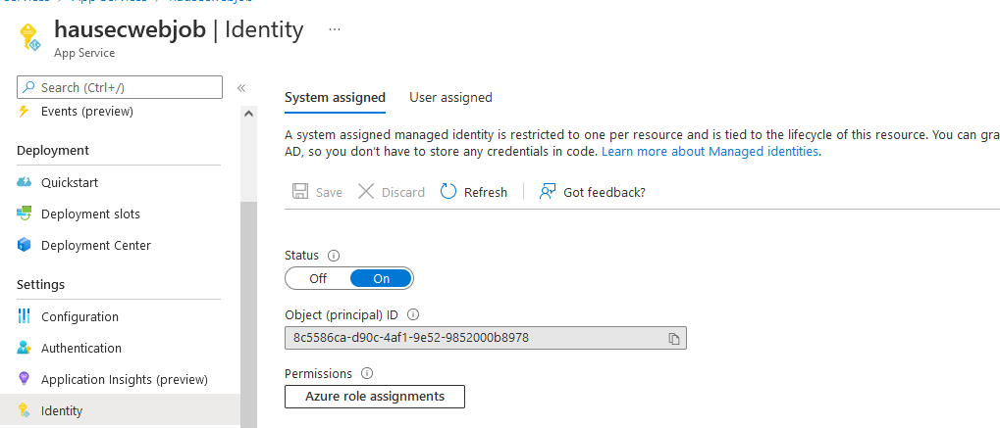

# AZT404.4 - Principal Impersonation: App Service
By utilizing an App Service configured with a managed identity or other identity provider, an attacker can execute Azure operations on a given resource.

!!! info "Resource" 

	App Service

!!! success "Actions"

	* Microsoft.Web/sites/write

!!! example "Examples"

    === "Az PowerShell"
		[`#!powershell Update-AzStaticWebApp`](https://docs.microsoft.com/en-us/powershell/module/az.websites/update-azstaticwebapp?view=azps-8.0.0)
		
	=== "Azure CLI"
		[`#!python az staticwebapp update`](https://docs.microsoft.com/en-us/cli/azure/staticwebapp?view=azure-cli-latest#az-staticwebapp-update)
		
	=== "Azure REST API"	
		[`#!powershell PUT https://management.azure.com/subscriptions/{subscriptionId}/resourceGroups/{resourceGroupName}/providers/Microsoft.Web/sites/{name}?api-version=2021-02-01`](https://docs.microsoft.com/en-us/rest/api/appservice/web-apps/create-or-update)		

    === "Azure Portal"
    	

 
!!! abstract "Detections"

	## **Logs** 

    | Data Source        | Operation Name     | Action                                                            | Log Provider |
    |--------------------|---------------------|-------------------------------------------------------------------|--------------|
    | Resource | Update website	 | Microsoft.Web/sites/write	| AzureActivity |
    | Resource | Start Web App | Microsoft.Web/sites/start/action	| AzureActivity |

!!! faq "Additional Resources"

	[https://docs.microsoft.com/en-us/azure/app-service/overview-managed-identity?tabs=portal%2Chttp](https://docs.microsoft.com/en-us/azure/app-service/overview-managed-identity?tabs=portal%2Chttp)
