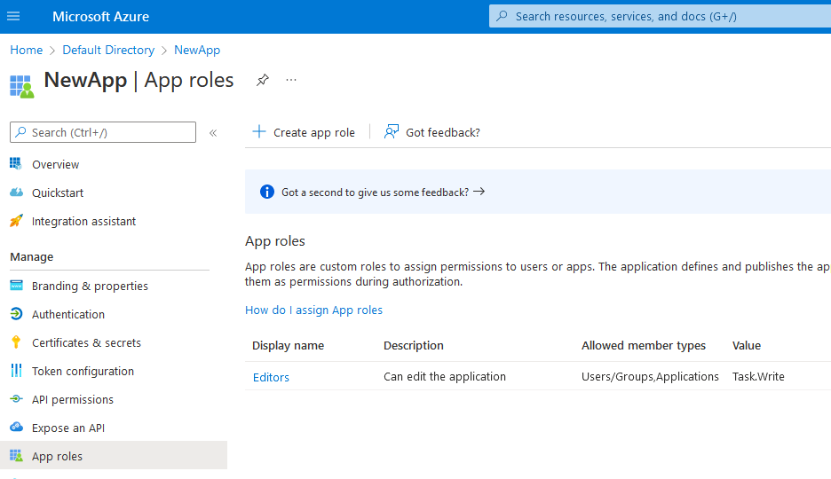

# AZT405.1 - Azure AD Application: Application Role

By compromising a user, user in a group, or service principal that has an application role over an application, they may be able to escalate their privileges by impersonating the associated service principal and leveraging any privileged assigned application role.

!!! info "Resource" 

	Azure Active Directory

!!! success "Actions"

	Since the attacker controls the application, no actions are needed.

!!! example "Examples"

	=== "Azure REST API"	
		[`#!powershell GET https://graph.microsoft.com/v1.0/servicePrincipals?$filter=appId eq '00000002-0000-0000-c000-000000000000'`](https://docs.microsoft.com/en-us/graph/migrate-azure-ad-graph-configure-permissions)		

    === "Azure Portal"
    	

!!! abstract "Detections"

	## **Logs** 

    | Data Source        | Operation Name     | Action                                                            | Log Provider |
    |--------------------|---------------------|-------------------------------------------------------------------|--------------|
    | Azure Active Directory | N/A	 | N/A	| AADServicePrincipalSignInLogs|

	## **Queries**

	| Platform | Query |
    |----------|-------|
	| Log Analytics | `#!sql AADServicePrincipalSignInLogs | where ServicePrincipalId == 'IDGOESHERE'` |
	
	## **Azure Monitor Alert**
	

!!! faq "Additional Resources"

	[https://docs.microsoft.com/en-us/graph/migrate-azure-ad-graph-configure-permissions](https://docs.microsoft.com/en-us/graph/migrate-azure-ad-graph-configure-permissions)
