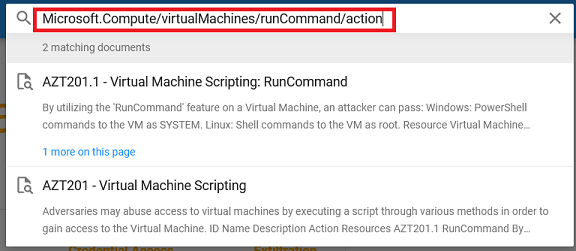
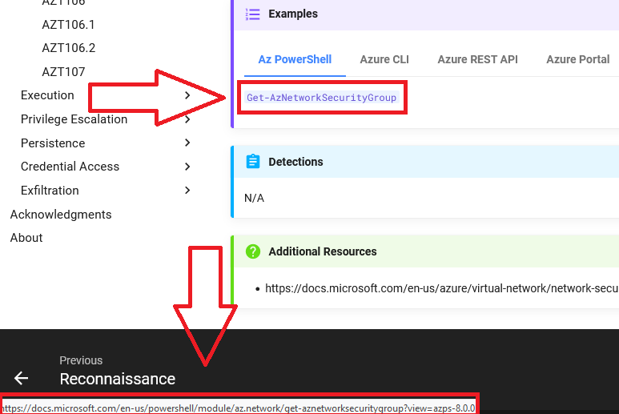

# 

|[<h3 style="color: #00A4EF">**Reconnaissance**</h3>](Reconnaissance/Reconnaissance.md)|[<h3 style="color: #00A4EF">**Initial Access**</h3>](InitialAccess/InitialAccess.md)|[<h3 style="color: #00A4EF">**Execution**</h3>](Execution/Execution.md)|[<h3 style="color: #00A4EF">**Privilege Escalation**</h3>](PrivilegeEscalation/PrivEsc.md)|[<h3 style="color: #00A4EF">**Persistence**</h3>](Persistence/Persistence.md)         |[<h3 style="color: #00A4EF">**Credential Access**</h3>](CredentialAccess/CredentialAccess.md)|[<h3 style="color: #00A4EF">**Exfiltration**</h3>](Exfiltration/Exfiltration.md)          |
|:--------------------------------------------------:|:-----------------------------------:|:-----------------------------------:|:----------------------------------------------------------------------------------------------------------------------------------------------------------------:|:--------------------------------------------------:|:---------------------------------------------------------:|:------------------------------------------------------:|
|[Port Mapping](Reconnaissance/AZT101/AZT101.md)                  |[Valid Credentials](InitialAccess/AZT201/AZT201.md)             |[Virtual Machine Scripting](Execution/AZT301/AZT301.md)|[Privileged Identity Management Role](PrivilegeEscalation/AZT401/AZT401.md)|[Account Manipulation](Persistence/AZT501/AZT501.md)                      |[Steal Managed Identity JsonWebToken](CredentialAccess/AZT601/AZT601.md)  |[SAS URI Generation](Exfiltration/AZT701/AZT701.md)   |
|[IP Discovery](Reconnaissance/AZT102/AZT102.md)                  |[Password Spraying](InitialAccess/AZT202/AZT202.md)             |[Unmanaged Scripting](Execution/AZT302/AZT302.md)      |[Elevated Access Toggle ](PrivilegeEscalation/AZT402/AZT402.md)            |[Account Creation](Persistence/AZT502/AZT502.md)                          |[Steal Service Principal Certificate](CredentialAccess/AZT602/AZT602-1.md)|[File Share Mounting](Exfiltration/AZT702/AZT702-1.md)|
|[Public Accessible Resource](Reconnaissance/AZT103/AZT103.md)    |[Malicious Application Consent](InitialAccess/AZT203/AZT203.md) |[Managed Device Scripting](Execution/AZT303/AZT303.md) |[Local Resource Hijack](PrivilegeEscalation/AZT403/AZT403-1.md)            |[HTTP Trigger](Persistence/AZT503/AZT503.md)                              |[Service Principal Secret Reveal](CredentialAccess/AZT603/AZT603-1.md)    |[Replication](Exfiltration/AZT703/AZT703-1.md)        |
|[Gather User Information](Reconnaissance/AZT104/AZT104.md)       |                                                                |                                                       |[Principal Impersonation](PrivilegeEscalation/AZT404/AZT404.md)            |[Watcher Tasks](Persistence/AZT504/AZT504.md)                             |[Azure KeyVault Dumping](CredentialAccess/AZT604/AZT604.md)               |[Soft-Delete Recovery](Exfiltration/AZT704/AZT704.md) |
|[Gather Application Information](Reconnaissance/AZT105/AZT105.md)|                                                                |                                                       |[Azure AD Application](PrivilegeEscalation/AZT405/AZT405.md)               |[Scheduled Jobs](Persistence/AZT505/AZT505-1.md)                          |[Resource Secret Reveal](CredentialAccess/AZT605/AZT605.md)               |                                                      |
|[Gather Role Information](Reconnaissance/AZT106/AZT106.md)       |                                                                |                                                       |                                                                           |[Network Security Group Modification](Persistence/AZT506/AZT506.md)       |                                                                          |                                                      |
|[Gather Resource Data](Reconnaissance/AZT107/AZT107.md)          |                                                                |                                                       |                                                                           |[External Entity Access](Persistence/AZT507/AZT507.md)                    |                                                                          |                                                      |
|[Gather Victim Data](Reconnaissance/AZT108/AZT108.md)            |                                                                |                                                       |                                                                           |[Azure Policy](Persistence/AZT508/AZT508.md)                              |                                                                          |                                                      |

??? help "How to Use"
	The top row designates the **tactic** being used and the rows below it are the specific **techniques** pertaining to that tactic. Clicking on a specific **tactic** will list the techniques specific to it. Clicking on a specific **technique** will bring you to the page on that technique and the details around it. 
 
	You can also utilize the search bar at the top to recursively search for specific text. For example, to search for what techniques a certain action or permission has, just enter the action in the search bar and it will show all relevant techniques.
		 
	
	When viewing the page of a technique, specific examples of how to abuse the technique with different methods are shown. By clicking on the given command, it will bring you to the documentation around it.
		 
		 

!!! attention "Disclaimer"
	The purpose of the Azure Threat Research Matrix (ATRM) is to educate readers on the potential of Azure-based tactics, techniques, and procedures (TTPs). It is not to teach how to weaponize or specifically abuse them. For this reason, some specific commands will be obfuscated or parts will be omitted to prevent abuse.  

!!! note "Feedback"

	With the intent of ATRM being a collaborative effort with the community, feedback is greatly appreciated. Is there a new or missing technique? Is the formatting off-putting? Please let me know [@haus3c](https://twitter.com/haus3c).

## [Acknowledgements](acknowledgments.md)
